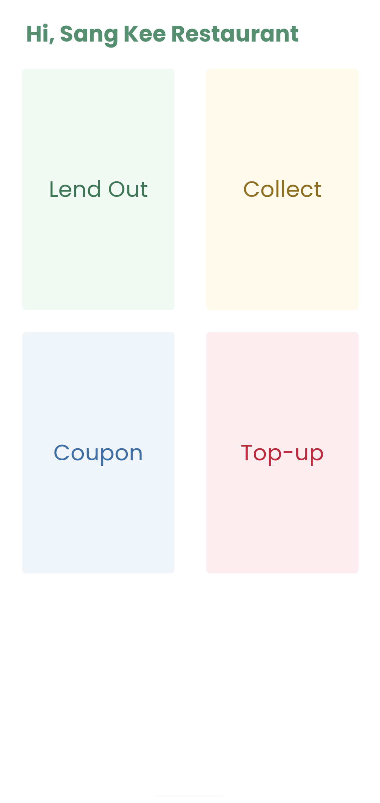
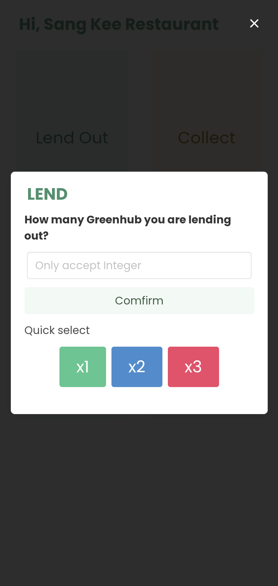
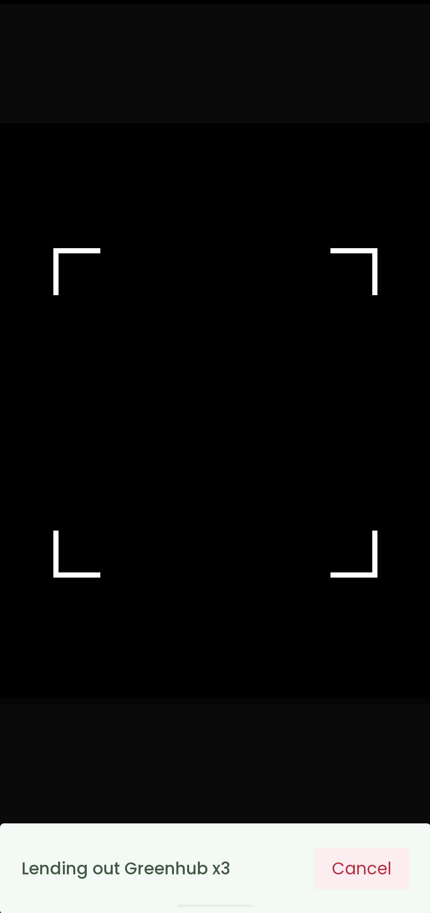

# greenhub-restaurant-client

A web mobile application for Greenhub Restaurants. Used to performing operations including lending Greenhub, collection Greenhub, topping up customer's Greenhub and verifying Greenhub coupons. These operations are done mainly by scanning QR code.

## Usage

1. Access [https://greenhub.restaurant.slmaaa.work](https://greenhub.restaurant.slmaaa.work)
2. (Optional) Add application to home page

## Main screen

1.  Home screen
    Select one of the four modes (Lending, Collecting, Topping up and Scanning Coupon) and input required data (through text input/ quick selection). 
    
    

2.  Scanning screen
    Scan QR code and verify the code with the server. If the code is verified, selected operation will be performed and record by the server. 
    
